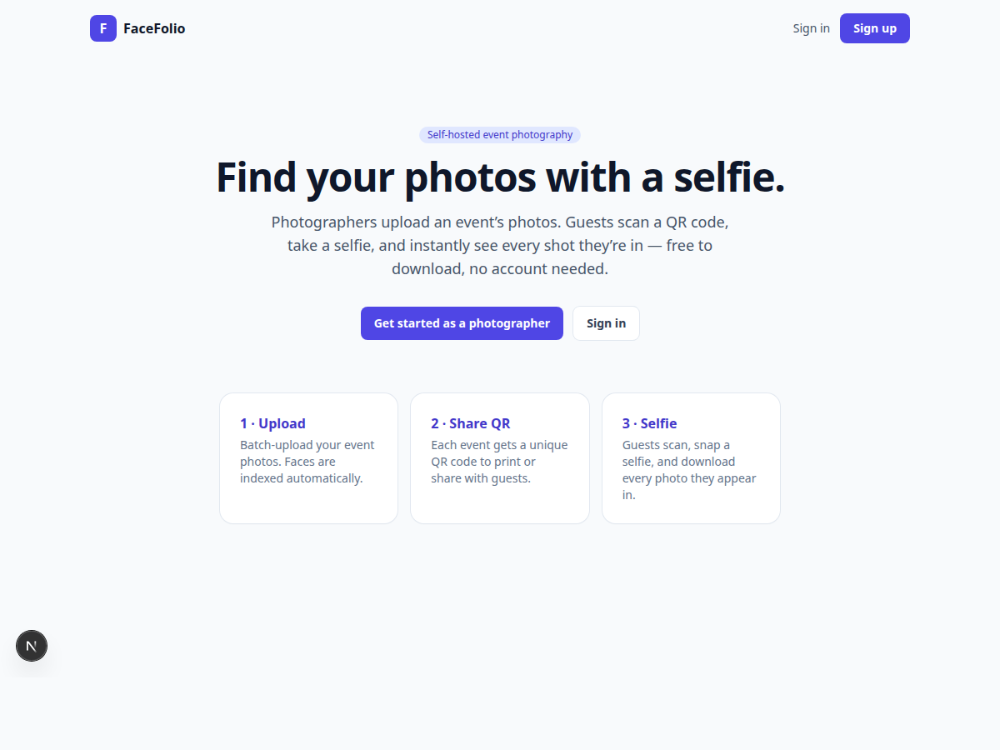
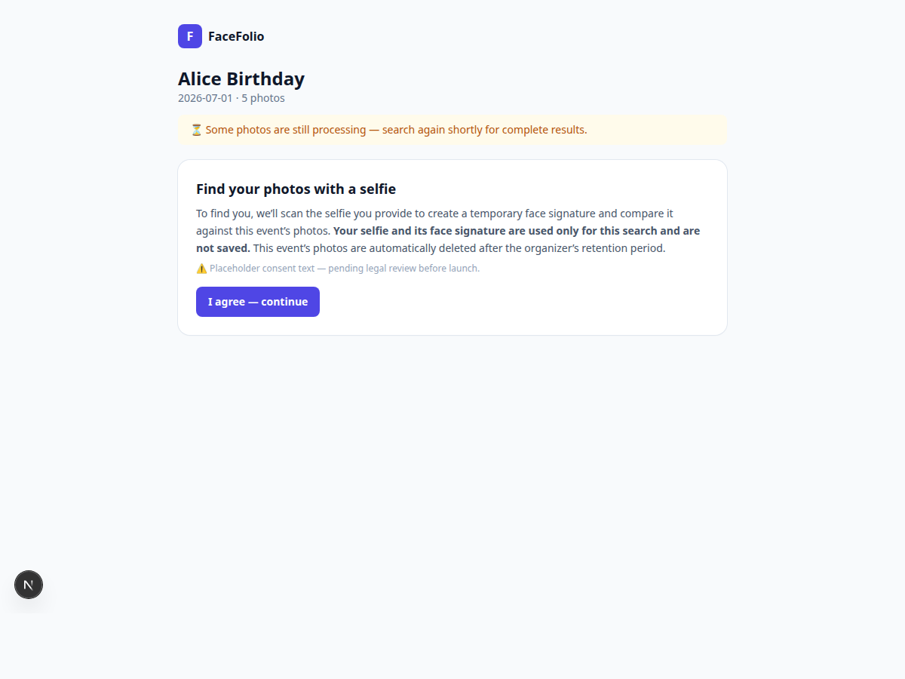

<h1 align="center">📸 FaceFolio</h1>

<p align="center">
  <strong>Find your event photos with a selfie.</strong><br>
  A self-hosted event-photography platform — photographers upload an event's photos,
  guests scan a QR code, take a selfie, and instantly get every shot they appear in.
</p>

<p align="center">
  
  
  
  
  
</p>

<p align="center">
  
  
</p>

---

## What it does

1. **Photographers** sign up (admin-approved), create an event, and batch-upload photos.
2. Every uploaded photo is **face-indexed automatically** in the background.
3. Each event gets a **unique QR code**.
4. **Guests** scan it → accept a privacy notice → take a **selfie** → instantly see a ranked
   gallery of every photo they're in, and download them (single or bulk ZIP) — **no account needed**.

The "magic": a guest's selfie is turned into a face embedding, matched against the event's
indexed faces with vector similarity search, and the matching photos come back in seconds.

## Why it's built the way it is

- **Self-hosted, no third-party SaaS** — face recognition (InsightFace) and storage (MinIO) run
  locally; your photos stay yours.
- **Privacy-first** — the guest's selfie embedding is computed in-request, used for one search, and
  **never persisted**; an event's photos + face index **auto-delete** after a retention period.
- **Per-event matching** — a face is only ever compared within the event it belongs to (better
  accuracy and privacy than a global index).

## Tech stack

| Layer | Tech |
|---|---|
| Backend / API | **Django 5.2 + Django REST Framework** (Django Admin = super-admin panel) |
| Frontend | **Next.js 15 + React 19 + Tailwind CSS** |
| Face recognition | **InsightFace** (`buffalo_l`, 512-dim ArcFace embeddings), ONNX Runtime (CPU) |
| Data | **PostgreSQL + pgvector** (relational + vector similarity search) |
| Object storage | **MinIO** (S3-compatible) |
| Background jobs | **Celery + Redis** (face indexing, retention purge) |
| Orchestration | **Docker Compose** (6 services) |

## Architecture

```
┌─────────────┐    ┌──────────────┐    ┌────────────────────┐
│  Next.js    │───▶│   Django +   │───▶│  PostgreSQL +      │
│  frontend   │    │   DRF API    │    │  pgvector          │ ← face embeddings
│ (portal +   │    │ + Admin      │    │  (metadata)        │
│  guest UI)  │    └──────┬───────┘    └────────────────────┘
└─────────────┘           │
                          ▼
                ┌──────────────────┐   ┌────────────────────┐
                │ Celery worker    │──▶│  MinIO             │
                │ + InsightFace    │   │  (photos + thumbs) │
                │ (face indexing)  │   └────────────────────┘
                └──────────────────┘
```

The selfie search runs **synchronously in the API process** (so the embedding never touches
Redis/Celery), querying pgvector with the inner-product operator that matches the HNSW index.

## Quick start

```bash
git clone git@github.com:Surajpadihar/facefolio.git
cd facefolio
cp .env.example .env          # tweak secrets/ports if you like
docker compose up --build     # first run builds images, runs migrations,
                              # and downloads the face model (~280 MB)
```

| Service | URL |
|---|---|
| Frontend (Next.js) | http://localhost:3000 |
| API | http://localhost:8088/api/ |
| Django Admin | http://localhost:8088/admin/ |
| MinIO console | http://localhost:9101 |

Create your super-admin (to approve photographers and manage everything):

```bash
docker compose exec api python manage.py createsuperuser
```

> Host ports are remapped (8088 / 6380 / 9100 / 9101) to avoid clashing with other local
> stacks — change them in `docker-compose.yml` if you prefer the defaults.

## Try the flow

1. Sign in at `/login`, create an event, and upload a few photos **that contain faces**.
2. Wait for the photos to turn **Indexed** (green), then open the event's **QR / guest link**.
3. Open that link, accept the notice, take a **selfie** → your matching photos appear.

## Feature highlights

- 🔐 Admin-approved photographer accounts (JWT auth) + Django Admin control panel
- 🧑‍🤝‍🧑 Multi-photographer **collaborators** per event
- 🖼️ Batch upload with live progress + per-photo indexing status; EXIF & **HEIC** (iPhone) supported
- 🤳 QR → consent → selfie → **ranked matches** with confidence scores
- ⬇️ Free single + **bulk ZIP** downloads
- 🛡️ Ephemeral selfie embeddings, per-event auto-delete (Celery beat), rate-limited search

## Status & roadmap

v1 is feature-complete and runs end-to-end locally. Planned next:

- Calibrate the face-match threshold on real event photos
- Legal review of the consent-notice copy (BIPA/GDPR)
- Production deployment (managed host + HTTPS) and CI

## License

Personal project. Note: the InsightFace `buffalo_l` model weights are **non-commercial /
research-use only** — a commercial face-recognition license is required before any paid use.
